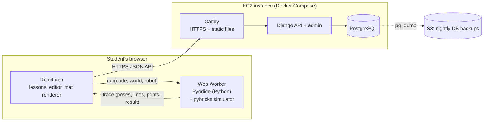
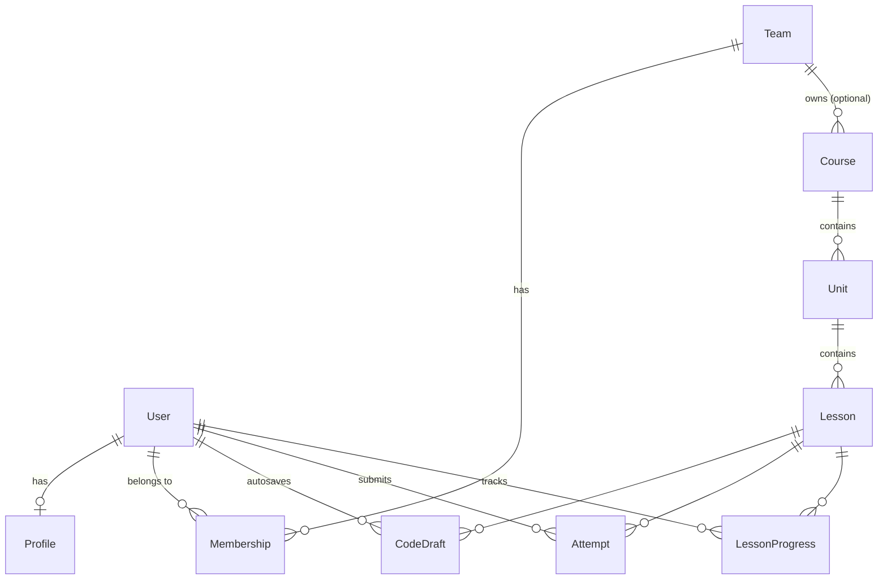

# Python Trainer: Architecture (v0.2)

A website that teaches FIRST LEGO League (FLL) Challenge students to program
their robot in Python with the [Pybricks](https://pybricks.com) API. The
centerpiece is a robot simulator in the browser: students write real Pybricks
code and watch a virtual robot drive on a virtual FLL table.

This document records the architecture decisions. The decision log at the
end lists what was settled and when.

---

## 1. Goals and constraints

| Topic | Decision |
|---|---|
| Audience | FLL Challenge students (about age 9 and up) with little text-coding experience, paired with older mentors |
| Robot API | Pybricks (`pybricks.hubs`, `pybricks.pupdevices`, `pybricks.robotics`, ...) |
| Core experience | Write Python, then watch a simulated robot run it. Moving the robot is the fun part. |
| Block coding | None. A read-only visualizer shows how loops and `if` statements run. |
| AI tutor | Not in v1. Leave room to add one later. |
| Users | Individual students in v1. The data model supports teams and coaches now; the coach UI comes later. |
| Lessons | Teachers can add their own lessons |
| Device | Laptop with a keyboard |
| Hosting | One AWS EC2 instance, reachable by students from other teams |

## 2. System overview



The server handles accounts, teams, lessons, saved code and progress.
**Student code never runs on the server.** It runs in the student's browser
inside a WebAssembly Python runtime (Pyodide).

## 3. Key decisions

| Decision | Choice | Why |
|---|---|---|
| Where student code runs | In the browser, using Pyodide inside a Web Worker | Running untrusted code from many kids on a public EC2 box would need a real sandbox, and that is a security project of its own. In the browser, each laptop does its own work, feedback is instant, and a classroom of 20 kids pressing Run doesn't overload a small server. |
| Language for the simulator | Pure Python, in the same Pyodide runtime as the student's code | Sensors must be read *while* the student's code runs (`color_sensor.reflection()` depends on where the robot is right now). Keeping the simulator in the same process avoids crossing between Python and JavaScript on every call. It can also be unit-tested with `pytest` and used in CI to check that lesson solutions still pass. |
| How the simulator runs | **Run first, then replay** (see §4.1) | Deterministic, fast, and no threading problems. Infinite loops are easy to cap. One trace drives both the robot animation and the code visualizer. |
| Backend | Django + Django Ninja (typed JSON API) + PostgreSQL | Built-in auth, database migrations and **Django admin, which gives teachers a lesson editor on day one**. It's Python end to end, which matches the subject. |
| Frontend | React + TypeScript + Vite; CodeMirror 6 editor; Canvas 2D renderer | Mainstream and well documented. CodeMirror is lighter than Monaco and makes Pybricks autocomplete easy to add. |
| Auth | Django session cookies (same domain) | Simpler and safer than JWTs for a single-domain app. |
| Deployment | Docker Compose on one EC2 instance: Caddy, Django (gunicorn), Postgres | Caddy provides automatic HTTPS. Because code runs in browsers, the server does very little and a small instance is enough. |

## 4. The simulator

### 4.1 Run first, then replay

1. The student clicks **Run**. The UI sends `{code, world, robot, options,
   goals}` to the Web Worker.
2. The worker starts a fresh simulation and turns on a line tracer
   (`sys.settrace`) for the student's file only. Then it runs the student's
   code.
3. Time is **virtual**:
   - Blocking Pybricks calls such as `drive_base.straight(300)` or
     `wait(500)` move the clock forward.
   - **Every line of student code costs 0.25 ms**, like a real hub running a
     loop, so `while sensor.reflection() > 50: pass` still lets the robot
     move.
   - The physics runs in fixed **5 ms ticks**, and sensors update once per
     tick.
   - Nothing waits in real time. A 34-second line-following run (136,000
     lines of Python) simulates in about 1.6 s in Chromium.
4. Sensor calls read the world at the robot's current pose.
5. The run ends in one of these ways:
   - The program finishes (or calls `raise SystemExit`).
   - It raises an error.
   - It reaches the time limit (default 150 s, the length of a match).
   - It reaches the line limit (a safety net).

   The limits raise a `BaseException`, so a student's `except Exception:`
   can't swallow them.
6. The worker returns a **trace**. The UI plays it back at real speed (or
   faster or slower) with a scrubber. It highlights the running line and
   shows the console, the variables and the sensor readings in sync with the
   robot.
7. Goals are checked by the simulator and returned in the trace. The UI
   reveals them when playback reaches the end. From milestone 3, it also
   saves the attempt to the server.

If the worker doesn't respond within 20 s of wall-clock time, the UI stops it
and starts a new one.

### 4.2 Python package layout (`sim/src/`)

The simulator provides modules with the **same names as real Pybricks**, so
code copied from the site runs on a real hub:

```
sim/src/
  pybricks/            # simulated Pybricks API that students import
    hubs.py            # PrimeHub: imu, display, light, speaker, buttons
    pupdevices.py      # Motor, ColorSensor, UltrasonicSensor, ForceSensor
    robotics.py        # DriveBase
    parameters.py      # Port, Direction, Stop, Color, Button, Side, Axis, Icon
    tools.py           # wait, StopWatch
  umath.py, urandom.py, micropython.py   # MicroPython names
  trainer_sim/         # the engine (students never import this)
    sim.py             # virtual clock, physics tick, sensors, recorder
    motion.py          # motors, speed profiles, motor controllers
    drive.py           # DriveBase controller (encoders or gyro)
    world.py, shapes.py  # mat, painted shapes, zones, obstacles, walls
    robot.py           # robot file: wheels, body, ports
    runner.py          # runs student code with limits and the line tracer
    goals.py           # checks challenge goals
    errors.py          # kid-friendly explanations and pre-run warnings
    snapshot.py        # formats variables for the variables panel
sim/tests/             # pytest; also runs every challenge solution in content/
```

The same package runs in Pyodide (Python 3.14) in the browser and in regular
Python (3.11 or newer) for tests and CI. The frontend bundles the `.py`
files and writes them into Pyodide's file system when the worker starts.

**Imports are allowlisted**: `pybricks`, `math`/`umath`, `random`/`urandom`
and `micropython`. That matches what a real hub offers, and it keeps student
code away from browser APIs (see §12).

### 4.3 Pybricks API covered in v1

| Module | Supported |
|---|---|
| `robotics.DriveBase` | `straight`, `turn`, `curve`, `arc`, `drive`, `stop`, `brake`, `distance`, `angle`, `state`, `reset`, `settings`, `use_gyro`, `done`, `stalled`; `then=` and `wait=` on moves |
| `pupdevices.Motor` | `run`, `run_angle`, `run_target`, `run_time`, `run_until_stalled`, `dc`, `track_target`, `stop`, `brake`, `hold`, `angle`, `reset_angle`, `speed`, `done`, `stalled`, `control.limits`; `positive_direction`, `gears` |
| `pupdevices.ColorSensor` | `color`, `reflection`, `hsv`, `ambient`, `detectable_colors` |
| `pupdevices.UltrasonicSensor` | `distance`, `presence` |
| `hubs.PrimeHub` | `imu.heading/reset_heading/angular_velocity/tilt`, `display.text/number/char/icon/off`, `light.on/off`, `speaker.beep/play_notes`, `buttons.pressed` (scripted presses), `battery`, `system` |
| `tools` | `wait`, `StopWatch` |

Calls that aren't supported yet, such as `multitask`, `run_task` and
`hub_menu`, raise a friendly "not in the simulator yet" message.

**Faithful mistakes.** The simulator only knows what a real drive base
knows, so common real-robot mistakes behave the same way:

- Forgetting `Direction.COUNTERCLOCKWISE` on the mirrored left motor makes the
  robot spin in place.
- A wrong `wheel_diameter` makes it drive the wrong distance.
- A `ColorSensor` on a motor's port raises the hub's "no device" error, with a
  friendly explanation.

### 4.4 World model

- Units are millimeters and degrees, the same as Pybricks. The origin is the
  **bottom-left corner of the mat**, with x to the right and y up.
- Positive heading means **clockwise**, matching Pybricks, so
  `hub.imu.heading()` and `drive_base.turn(90)` agree with the drawing. A
  heading of 0 faces right.
- The default table is the FLL size, 2362 × 1143 mm, and the table's edges
  are walls.
- A world is a YAML file in `content/worlds/`:
  - **`shapes`**: painted shapes the color sensor can see, drawn in order
    (later shapes on top). There are four types:
    - `rect`, with an optional `angle`.
    - `circle`.
    - `line`: tape through points, with a `width`.
    - `arc`: part of a ring, sweeping clockwise from `start` to `end`.
  - **`zones`**: named, invisible areas used by goals. They're drawn as
    dashed outlines.
  - **`obstacles`**: rects and circles the robot bumps into. The robot stops
    and a `collision` event is recorded.
  - **`start`** pose, plus an optional `grid` spacing for the drawing. A
    challenge can override the start pose.
- **The color sensor sees a spot, not a point** (6 mm radius). Reflection
  blends smoothly across the edge of a line, which is what makes
  proportional line following work, just like on a real mat.
- Worlds are drawn from shapes instead of images. Color readings are exact,
  teachers can write worlds without an image editor, and we avoid
  copyrighted season-mat artwork.

### 4.5 Robot model

- **Standard robot**: "Trainer Bot" (`content/robots/trainer-bot.yaml`).

  | Part | Details |
  |---|---|
  | Wheels | 56 mm wheels, 112 mm axle track |
  | Port A | Left wheel (mounted mirror-image) |
  | Port B | Right wheel |
  | Port C | Color sensor, 75 mm ahead of the axle |
  | Port D | Ultrasonic sensor, at the front |
  | Ports E, F | Arm motors, with ±90° mechanical limits |

  Custom robots and robot mods come later.
- **Movement**: the robot steers by driving its two wheels at different
  speeds.
  - Motors are ideal position-controlled servos, limited by top speed
    (1000°/s), mechanical limits and collisions.
  - Moves follow trapezoid speed profiles (as set by
    `DriveBase.settings`).
  - With `use_gyro(True)`, the drive base corrects its heading using the
    gyro.
- **Realism** (`realism: on` in a challenge; fixed seed, so every run of the
  same code gives the same result):
  - The left wheel is 2.5% smaller than the right.
  - The wheels slip about 1%.
  - The gyro drifts 0.05°/s.
  - Sensor noise has a standard deviation of 1.5.

  Imperfections are added where wheel rotation becomes movement, so encoder
  readings stay perfect, like on a real robot. Without the gyro, a 1.6 m
  straight drifts about 27 cm. With the gyro it stays on target. The
  "Straight as an Arrow" challenge teaches exactly this.

### 4.6 Trace format (worker → UI)

Frames are stored as columns to keep the trace small (about 50 frames per
second of robot time):

```jsonc
{
  "sim_version": "0.1.0",
  "frame_ms": 20,
  "start":   {"x": 200, "y": 200, "heading": 0},
  "frames":  {"t": [...], "x": [...], "y": [...], "heading": [...], "line": [...]},
  "sensors": {"gyro": [...], "C.reflection": [...], "C.color": [...], "D.distance": [...]},
  "motors":  {"E": [...], "F": [...]},             // arm angles
  "steps":   [[t, line], ...],                      // every line run (first 5000)
  "vars":    [{"t": 12.5, "vars": [["speed", "200", "global"], ...]}, ...],  // on change
  "prints":  [{"t": 1200, "line": 14, "text": "Found the line!"}],
  "events":  [{"t": 3400, "type": "collision", "what": "wall", "line": 9}],   // also beep, display, light, stalled
  "end":     {"reason": "finished" | "error" | "time_limit" | "step_limit", "t": 3600, "line": 9,
              "error": {"type": "NameError", "line": 5, "kid_message": "...", "python_message": "..."}},
  "warnings": [{"line": 7, "message": "`drive_base.stop` doesn't do anything by itself..."}],
  "goals":   [{"id": "no-errors", "label": "Program runs without errors", "passed": true, "detail": ""}, ...],
  "stats":   {"lines": 688, "sim_ms": 3600, "wall_ms": 40}
}
```

### 4.7 Challenge goals

Goals are declarative so teachers can write them without writing code.
Zone checks use the center of the robot. Any challenge with goals also gets
an automatic first goal: "Program runs without errors".

| Goal type | Example |
|---|---|
| `end_in_zone` | `{type: end_in_zone, zone: garage}` |
| `visit_zones` | `{type: visit_zones, zones: [a, b, c], in_order: true}` |
| `avoid_zones` | `{type: avoid_zones, zones: [pit]}` |
| `no_collisions` | Don't bump into walls or obstacles |
| `max_time` | `{type: max_time, seconds: 30}` |
| `must_use` | `{type: must_use, construct: for}`. Also `while`, `if`, `def`, `list`, `variable`, `fstring`, `floor_divide` (`//`) or `modulo` (`%`) (checked by parsing the code). |
| `max_calls` | `{type: max_calls, name: straight, value: 1}`. Encourages loops and functions. `value: 0` means "don't use it" (e.g. drive with motors instead). |
| `uses_variable_in` | `{type: uses_variable_in, name: straight}`. Every call gets a variable, not a plain number. |
| `printed` | `{type: printed, text: "Found it"}` |

## 5. Code visualizer

The visualizer is read-only. Students watch it; they don't build anything
with it. It uses the same recording as the robot playback, in two modes.

**Robot time (challenges)**: the trace plays at real speed (0.5× to 4×) with a
scrubber. The running line is highlighted in the editor. The console,
variables (changed values flash) and sensor readings follow the robot.

**Step mode** (`visualize` blocks, and "👣 Step through" on any example) shows
one line at a time. The controls are start, back, play/pause, forward and a
speed setting. For each step it shows:

- **The line about to run**, highlighted.
- **How many times each line has run**, in a gutter (`×3`). This makes loops
  and skipped branches visible at a glance.
- **A note on the current line**, computed from the program's structure
  (`trace.structure`: every `for`, `while`, `if` and `elif`, with the lines of
  its body) and from the next step:
  - `if`/`elif`: "✔ True: runs the indented lines" or "✖ False: skips them".
  - `for`: "🔁 round 2: side = 1", with the loop variable's next value.
  - `while`: "🔁 round 2: condition is True", then "✅ loop done after 3 rounds".
  - While inside a loop, the loop's first line keeps a "🔁 round k" badge.
- **Variables and output so far**, next to the code.

Timing: every recorded print and step is stamped to 0.01 ms, and a print
made by line *k* has the same time as step *k + 1*. So output appears exactly
when the student steps past the line that printed it. Step mode shows up to
5000 steps; content checks reject `visualize` blocks that need more.

## 6. Kid-friendly errors

Every error shows two messages: the real Python message (so students learn to
read it) and a plain-English explanation that points to the line. The
explanations come from a curated list, with no AI involved. Examples:

- `IndentationError` → "Python uses spaces at the start of a line to know
  what's inside a loop. Line 6 needs to line up with line 5."
- `NameError: 'drivebase'` → "Python doesn't know `drivebase`. Did you mean
  `drive_base` from line 3?"
- A missing `:` → "Lines that start with `for`, `if`, `while` or `def` need a
  `:` at the end."
- A warning before running: `drive_base.straight` without `(...)` does
  nothing.

## 7. Lessons and authoring

### 7.1 Content structure

**Course → Unit → Lesson → Blocks**. There are five block types:

| Block | Purpose | Fields |
|---|---|---|
| `text` | Markdown explanation (Python code fences are highlighted) | `markdown` |
| `example` | Code the student can run, edit and step through; shows output and errors | `code`, `expect_error` |
| `visualize` | Opens in step mode (§5); students can still edit and re-run | `code`, `expect_error` |
| `quiz` | Multiple choice. `check: output` is "what does this print?": the checker runs `code` and makes sure the answer matches the real output. | `question`, `code`, `choices` (text, or `{text, why}`), `answer` (index from 0), `explain`, `check` |
| `challenge` | Editor + simulator + goals + hints. Without `world` it's a console-only challenge. `ref:` reuses a playground challenge. | same as a playground challenge file |

Every block gets an `id` (given, or `block-N` from its position), which
progress and saved code are keyed on.

### 7.2 Lesson files

```
content/courses/fll-python/course.yaml            # id, title, summary
content/courses/fll-python/01-meet-the-robot/unit.yaml     # id, title, icon, summary
content/courses/fll-python/01-meet-the-robot/01-hello-python.yaml
content/courses/fll-python/01-meet-the-robot/02-first-moves.yaml
content/challenges/*.yaml                          # playground challenges
```

Units and lessons are ordered by their file names. Code is written inline in
the YAML, which keeps each lesson a single JSON document for the database
(milestone 3). A short example:

```yaml
id: for-loops
title: Repeat with for
summary: Use a for loop to repeat code a set number of times.
blocks:
  - type: text
    markdown: |
      Robots do the same thing again and again...
  - type: visualize
    code: |
      for side in range(4):
          print("Round", side)
  - type: quiz
    check: output
    question: What does this program print?
    code: |
      for i in range(3):
          print("beep")
    choices: ["beep", "beep\nbeep\nbeep"]
    answer: 1
  - type: challenge
    ref: square-dance          # reuse a playground challenge
```

**Pages.** The lesson player splits a lesson into pages. A page ends after
each interactive block (example, visualize, quiz, challenge), so text always
introduces the thing that follows it. On a challenge page, the page's text is
shown in the challenge card, above the challenge's own instructions.

**Progress.**
- A quiz must be answered correctly before the student can continue. Wrong
  answers show the choice's `why`.
- A challenge with goals can be skipped, but the lesson only counts as
  complete once it's solved.
- A lesson is complete when the student reaches the end with every quiz and
  goal challenge done.
- Until accounts exist, progress and edited code live in the browser
  (`localStorage`). Milestone 3 moves them to the server (`LessonProgress`,
  `CodeDraft`, `Attempt`).

**Validation** (`sim/src/trainer_content`, run by `pytest` and later by the
backend):
- Structure, ids and quiz answers.
- Examples and visualize blocks must run (or fail, when `expect_error` is
  set).
- Output quizzes are checked against the real output.
- Goal zones must exist in the world.
- Challenge solutions must pass their goals, and starters must run without
  already passing.

### 7.3 How teachers add lessons

- **Database is the source of truth at runtime.** A lesson's content is stored
  as JSON using the schema above.
- **File import**: `manage.py import_content content/` loads or updates the
  lessons in the repo.
- **Web editing (v1)**: Django admin, with a schema-validated YAML/JSON field
  and a "Preview" link that opens the lesson as a student sees it.
- **Validation**: the `trainer_content` checker (§7.2) runs in CI and when a
  lesson is saved in admin. A lesson with problems is rejected, with a list of
  what's wrong.
- **Team-specific lessons**: a course has an optional owner team. Blank means
  everyone can see it; otherwise only that team can. This lets a coach write
  lessons just for their team.
- **Versioning**: each lesson has a `version` number. Attempts record the
  version they were made against, so editing a lesson doesn't break
  students' history.
- **Later**: a dedicated authoring UI with a visual world editor.

### 7.4 Starting curriculum

Units 1–4 are written (12 lessons, each ending in a challenge):

| Unit | Lessons |
|---|---|
| 1. Meet the Robot | Hello, Python! (print, strings, comments, bugs) · First Moves (setup lines, `straight`, mm) · Turning (`turn`, sequences; "Around the Crate") |
| 2. Variables | Variables Are Boxes (assignment, naming; "Score Keeper") · Variables Drive the Robot (`+=`; "There and Back Again") · Text and Numbers (types, f-strings; "Mission Report") |
| 3. Math for Robots | Python Is a Calculator (`//`, `%`; "Match Timer") · Wheels and Circles (π, degrees ↔ mm; "Motor Math" with `run_angle`) · Speed × Time (`drive` + `wait`; "Timed Parking") |
| 4. Loops | Repeat with for ("Square Dance") · Repeat with while ("Stop at the Line") · Lists and Loops (lists, indexes, `append`; "Spiral") |

The plan for all units:

1. **Meet the robot**: `print`, running code, the robot's first `straight()`
2. **Variables**: assigning, naming, updating (`speed = speed + 50`)
3. **Math for robots**: wheel circumference, and converting degrees to mm
4. **Loops**: `for`/`range`, `while`
5. **Decisions**: `if`/`elif`/`else`, comparisons, "stop at the black line"
6. **Functions**: `def turn_left(deg)`, parameters, `return`
7. **Lists**: storing a sequence of moves or waypoints, looping over a list
8. **Sensors**: color and reflection, the gyro, turning with the gyro
9. **Line following**: bang-bang, then proportional
10. **Proportional control**: driving straight with the gyro, tuning the gain
    `k`
11. **Mission runner**: a list of mission functions and a menu that uses the
    hub's buttons
12. **Debugging**: reading errors, printing values, testing one piece at a
    time

## 8. Accounts, teams and data model



| Model | Key fields |
|---|---|
| `User` (Django) | username, password. **Students have no email.** |
| `Profile` | display_name, avatar (preset), kind: student / adult |
| `Team` | name, season, join_code |
| `Membership` | user, team, role: `student` / `mentor` / `coach` |
| `Course`, `Unit`, `Lesson` | slug, title, order, published; `Lesson.content` (JSON), `Lesson.version` |
| `CodeDraft` | user, lesson, block_id, code, updated_at |
| `Attempt` | user, lesson, block_id, lesson_version, code, passed, goal_results (JSON), sim_version, created_at |
| `LessonProgress` | user, lesson, status (not started / in progress / done), completed_at |

**Built now, used later by the coach app:** a permission rule that says
"coaches and mentors can read the drafts, attempts and progress of students
on their team". It's enforced in one place in the API layer. The coach UI
will only need new screens, not new data.

Pass/fail is computed in the browser and reported to the server. A student
could fake a pass. That's fine for a learning tool, and it's the trade-off
for never running student code on the server.

## 9. API sketch (v1)

```
POST /api/auth/login | /api/auth/logout      GET /api/me
POST /api/teams/join            {join_code}
GET  /api/courses               GET /api/courses/{slug}
GET  /api/lessons/{id}          (never includes solution code)
GET  /api/lessons/{id}/drafts   PUT /api/lessons/{id}/drafts/{block_id}
POST /api/lessons/{id}/attempts
GET  /api/me/progress
# later: /api/teams/{id}/students, /api/teams/{id}/progress, ...
```

Django Ninja publishes an OpenAPI schema, and the TypeScript API client is
generated from it.

## 10. Frontend

- **Pages**: log in or join a team; course map (a path of lessons, styled
  like an FLL field); lesson player; challenge workspace; playground (free
  driving on any practice mat, no goals).
- **Challenge workspace layout**: editor on the left; mat on the right;
  console, variables and goals below. Buttons: Run, Reset, Hint, Copy for
  Pybricks.
- **Libraries**: React Router, TanStack Query (server data), CodeMirror 6
  (Python mode, Pybricks autocomplete, line highlighting), Canvas 2D
  renderer, Comlink (to talk to the Web Worker).
- **Pyodide** is served from our own domain rather than a CDN, because some
  school networks block CDNs. The browser caches it after the first visit.

## 11. Deployment

- **Instance**: one EC2 instance (a small one to start) with an Elastic IP
  and a domain name.
- **Docker Compose** services:
  - `caddy`: HTTPS certificates, serves the built frontend and Pyodide with
    long cache headers, and proxies `/api` and `/admin`.
  - `web`: Django on gunicorn.
  - `db`: PostgreSQL with a persistent volume.
- **Backups**: a nightly `pg_dump` to S3, using the instance's IAM role.
- **Security group**: open only ports 80 and 443. Use SSM Session Manager
  (or SSH limited to your IP) for admin access.
- **CI (GitHub Actions)**: simulator tests, backend tests, lesson solution
  validation, frontend type checks and tests, then build the Docker images.
  Deploy with `docker compose pull && up -d`.

## 12. Sign-in and privacy (children under 13)

- **Early sign-up**: students choose a **username and a PIN**. There's no
  email, real name or birth date. The sign-up page suggests a made-up name
  instead of a real one.
- **Later (coach app)**: a coach creates and manages student accounts and
  hands out usernames and PINs. They can also reset a forgotten PIN. The
  data model (§8) already supports this: a coach's `Membership` gives them
  authority over the students on their team.
- **PIN security**: a PIN is short, so it gets extra protection:
  - Hashed the same way Django hashes passwords.
  - Lockout after repeated failures, limited per account and per IP address.
  - A minimum length (6 digits proposed).
  - Rejection of obvious PINs such as `123456` and `000000`.
  - Adult accounts (coaches) use full passwords.
- Collect as little as possible. Students get a username, a display name and
  a preset avatar, with no free-text profile.
- Student code and attempts are visible only to the student and, later, to
  their team's coaches and mentors.
- Nothing is sent to third parties. No analytics SDKs in v1.
- **When coaches can run a student's code** (a later feature), the simulator
  worker must have no access to the coach's logged-in session. For example,
  it can be served from a separate origin, so student code can't make API
  calls as the coach. v1 already blocks imports that aren't on an allowlist
  (§4.2). Real hubs don't have most Python modules, so this also teaches the
  real limits.

## 13. Repository layout

```
python-trainer/
  sim/          Python simulator + simulated pybricks package (pytest, uv);
                trainer_content: lesson loader and checker (reused by the backend)
  backend/      Django project: accounts, teams, curriculum, progress
  frontend/     React + TS app: lesson player, editor, renderer, worker
  content/      Lessons, worlds and robot files (YAML + .py)
  deploy/       docker-compose.yml, Caddyfile, backup script
  docs/         This document and later design notes
```

## 14. Roadmap

| Milestone | Scope |
|---|---|
| **M1: Simulator playground** ✅ | `sim/` package + tests; Web Worker with Pyodide; mat renderer; editor; trace playback; friendly errors. No accounts. This is the riskiest and most fun part, so it gets built and tested with a real kid first. |
| **M2: Lessons** ✅ | Lesson schema, lesson player, visualizer, quizzes, goals, hints; first 4 units of the curriculum |
| **M3: Accounts & progress** | Django backend, teams and join codes, drafts, attempts, progress, admin lesson editing, content import and validation |
| **M4: Deploy** | EC2 + Compose + Caddy + backups + CI |
| **M5: Rest of the curriculum** | Sensors, line following, proportional control, mission runner |
| **Later** | Coach dashboard, a better lesson authoring UI with a world editor, AI tutor (a proxy endpoint on the server), pushable mission models, custom robot files, season-specific mats |

## 15. Decision log

| Date | Decision |
|---|---|
| 2026-09-26 | Pybricks API, browser simulator, no block coding, AI tutor later, coach app later but data model ready |
| 2026-09-26 | Student code runs in the browser (Pyodide). The EC2 server stores accounts, lessons and progress. |
| 2026-09-26 | Early sign-up with username + PIN. Later, coaches manage accounts and hand out usernames and PINs. |
| 2026-09-26 | One standard training robot ("Trainer Bot"). Custom robots and robot mods come later. The app is mainly about Python. |
| 2026-09-26 | Original practice mats built from shapes. No copyrighted season artwork. |
| 2026-09-26 | Pushing or collecting mission models comes after v1 |
| 2026-09-27 | Lessons are YAML files with code inline, paged after each interactive block. Quizzes gate progress; challenges can be skipped. Progress stays in the browser until milestone 3. |
