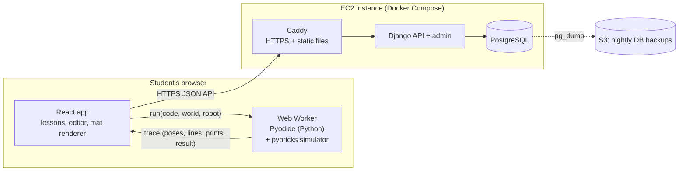
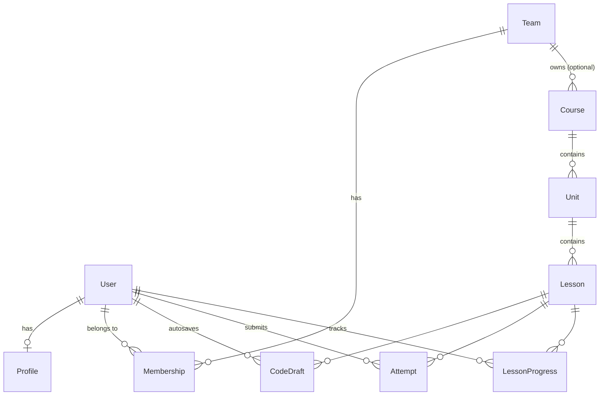

# Python Trainer: Architecture (Draft v0.1)

A website that teaches FIRST LEGO League (FLL) Challenge students to program
their robot in Python with the [Pybricks](https://pybricks.com) API. The
centerpiece is a robot simulator in the browser: students write real Pybricks
code and watch a virtual robot drive on a virtual FLL table.

This document records the architecture decisions made before building
features. Open questions are at the end.

---

## 1. Goals and constraints

| Topic | Decision |
|---|---|
| Audience | FLL Challenge students (about age 9 and up) with little text-coding experience, paired with older mentors |
| Robot API | Pybricks (`pybricks.hubs`, `pybricks.pupdevices`, `pybricks.robotics`, ...) |
| Core experience | Write Python, then watch a simulated robot run it. Moving the robot is the fun part. |
| Block coding | None. A read-only visualizer shows how loops and `if` statements run. |
| AI tutor | Not in v1. Leave room to add one later. |
| Users | Individual students in v1. The data model supports teams and coaches now; the coach UI comes later. |
| Lessons | Teachers can add their own lessons |
| Device | Laptop with a keyboard |
| Hosting | One AWS EC2 instance, reachable by students from other teams |

## 2. System overview



The server handles accounts, teams, lessons, saved code and progress.
**Student code never runs on the server.** It runs in the student's browser
inside a WebAssembly Python runtime (Pyodide).

## 3. Key decisions

| Decision | Choice | Why |
|---|---|---|
| Where student code runs | In the browser, using Pyodide inside a Web Worker | Running untrusted code from many kids on a public EC2 box would need a real sandbox, and that is a security project of its own. In the browser, each laptop does its own work, feedback is instant, and a classroom of 20 kids pressing Run doesn't overload a small server. |
| Language for the simulator | Pure Python, in the same Pyodide runtime as the student's code | Sensors must be read *while* the student's code runs (`color_sensor.reflection()` depends on where the robot is right now). Keeping the simulator in the same process avoids crossing between Python and JavaScript on every call. It can also be unit-tested with `pytest` and used in CI to check that lesson solutions still pass. |
| How the simulator runs | **Run first, then replay** (see §4.1) | Deterministic, fast, and no threading problems. Infinite loops are easy to cap. One trace drives both the robot animation and the code visualizer. |
| Backend | Django + Django Ninja (typed JSON API) + PostgreSQL | Built-in auth, database migrations and **Django admin, which gives teachers a lesson editor on day one**. It's Python end to end, which matches the subject. |
| Frontend | React + TypeScript + Vite; CodeMirror 6 editor; Canvas 2D renderer | Mainstream and well documented. CodeMirror is lighter than Monaco and makes Pybricks autocomplete easy to add. |
| Auth | Django session cookies (same domain) | Simpler and safer than JWTs for a single-domain app. |
| Deployment | Docker Compose on one EC2 instance: Caddy, Django (gunicorn), Postgres | Caddy provides automatic HTTPS. Because code runs in browsers, the server does very little and a small instance is enough. |

## 4. The simulator

### 4.1 Run first, then replay

1. The student clicks **Run**. The UI sends `{code, world, robot, limits}` to
   the Web Worker.
2. The worker resets the simulated world and turns on a line tracer
   (`sys.settrace`) that records which line runs, at what simulated time, and
   the values of simple variables. Then it runs the student's code.
3. Blocking Pybricks calls such as `drive_base.straight(300)` or `wait(500)`
   move a **virtual clock** forward. The simulator steps the robot's motion in
   fixed 10 ms steps and records the robot's pose at each step. Nothing waits
   in real time, so a 2½-minute match takes milliseconds to compute.
4. Sensor calls read the world at the robot's current pose.
5. The run ends when the program finishes, raises an error, reaches the time
   limit (default 150 s, the length of a match), or reaches the step limit
   (which catches `while True: pass`).
6. The worker returns a **trace**. The UI plays it back at real speed (or
   faster or slower), highlighting code lines and showing the console and
   variables in sync with the robot.
7. The UI checks the challenge goals against the trace and saves the attempt
   to the server.

If the worker doesn't respond within a wall-clock limit, the UI stops it and
starts a new one.

### 4.2 Python package layout (`sim/`)

The simulator installs modules with the **same names as real Pybricks**, so
code copied from the site runs on a real hub:

```
sim/
  pybricks/            # fake Pybricks API that students import
    hubs.py            # PrimeHub: imu, display, light, speaker, buttons
    pupdevices.py      # Motor, ColorSensor, UltrasonicSensor, ForceSensor
    robotics.py        # DriveBase
    parameters.py      # Port, Direction, Stop, Color, Button, Side
    tools.py           # wait, StopWatch
  trainer_sim/         # the engine (students never import this)
    world.py           # mat, shapes, zones, obstacles, color lookup
    robot.py           # robot geometry, ports, motion and wheel math
    clock.py           # virtual time
    trace.py           # records poses, lines, prints and events
    runner.py          # runs student code with limits and the line tracer
    goals.py           # checks challenge goals against a trace
    errors.py          # turns Python errors into kid-friendly explanations
  tests/
```

The same package runs in Pyodide in the browser and in regular Python for
tests and CI.

### 4.3 Pybricks API covered in v1

| Module | Supported |
|---|---|
| `robotics.DriveBase` | `straight`, `turn`, `drive`, `stop`, `distance`, `angle`, `reset`, `settings`, `use_gyro` |
| `pupdevices.Motor` | `run`, `run_angle`, `run_time`, `run_target`, `stop`, `hold`, `angle`, `reset_angle`, `speed` |
| `pupdevices.ColorSensor` | `color`, `reflection`, `hsv` |
| `pupdevices.UltrasonicSensor` | `distance` |
| `hubs.PrimeHub` | `imu.heading`, `imu.reset_heading`, `display.text/number/char`, `light.on/off`, `speaker.beep`, `buttons.pressed` |
| `tools` | `wait`, `StopWatch` |

Calls that aren't supported raise a friendly "not in the simulator yet"
message. `async`/`multitask` is out of scope for v1.

### 4.4 World model

- Units are millimeters and degrees, the same as Pybricks.
- The default table is the FLL size, about 2362 × 1143 mm.
- Positive heading means **clockwise**, matching Pybricks, so
  `hub.imu.heading()` and `drive_base.turn(90)` agree with the drawing.
- A world is a YAML/JSON file:
  - **Shapes** (rectangles, circles, lines of a given width and color) that
    the color sensor can see.
  - **Zones**: named areas used by goals ("end in the blue base").
  - **Obstacles and walls**: the robot stops when it hits one, and the hit is
    recorded as an event.
  - **Start pose**.
- Worlds are drawn from these shapes instead of from images. Color readings
  are exact, teachers can write worlds without an image editor, and we avoid
  copyrighted season-mat artwork (see open questions).

### 4.5 Robot model

- **Movement**: the robot steers by driving its two wheels at different
  speeds. Speed ramps up and down (as set by `DriveBase.settings`), and the
  simulator tracks each wheel's rotation so `Motor.angle()` and
  `drive_base.distance()` report the right values.
- **Robot file**: wheel diameter, axle track (distance between the wheels),
  footprint, and which **device is on which port**, including each sensor's
  position on the robot. Creating a device on an empty port raises the same
  kind of error a real hub does.
- **Attachment motors** (arms) turn and show up as an angle indicator in v1.
  They don't move objects yet.
- **Realism settings** (per lesson, with a fixed random seed so every run of
  the same code gives the same result): wheel slip, one motor slightly weaker
  than the other, gyro drift, sensor noise. Early lessons turn these off.
  The gyro and proportional-control lessons turn them on to show *why* those
  techniques matter.

### 4.6 Trace format (worker → UI)

```jsonc
{
  "sim_version": "0.1.0",
  "dt_ms": 10,
  "frames": [[t, x, y, heading, left_deg, right_deg, arm_deg], ...],
  "lines":  [{"t": 0, "line": 7, "vars": {"i": 2, "speed": 150}}, ...],
  "prints": [{"t": 1200, "text": "Found the line!"}],
  "events": [{"t": 3400, "type": "collision", "with": "wall"}],
  "end":    {"reason": "finished" | "error" | "time_limit" | "step_limit",
             "error": {"line": 5, "kid_message": "...", "python_message": "..."}},
  "goals":  [{"id": "reach-blue", "passed": true, "detail": "..."}]
}
```

### 4.7 Challenge goals

Goals are declarative so teachers can write them without writing code:

| Goal type | Example |
|---|---|
| `end_in_zone` | Finish inside the base |
| `visit_zones` | Visit A, B, C, D (optionally in order) |
| `avoid_zones` / `no_collisions` | Don't touch the wall |
| `max_time` | Finish within 30 s |
| `must_use` | The code must contain a `for` loop or a function (checked by parsing the code) |
| `max_lines` | Solve it in 12 lines or fewer (encourages loops and functions) |
| `printed` | The output includes a given value |

## 5. Code visualizer

The visualizer is read-only. It has play, pause, replay and speed controls,
but students don't build anything with it. It uses the same line and variable
recording as the simulator.

- **During challenge runs**: the current line is highlighted in the editor, a
  variables panel flashes values as they change, and the console prints in
  sync with the robot.
- **"Visualize" lesson blocks**: a code sample runs step by step with a loop
  iteration counter, the `if`/`else` branch taken shown in green (the skipped
  one in gray), and changing variables shown next to the code.

Several lines can run at the same simulated time. So playback has two modes:
**robot time** (real timing, for challenges) and **step mode** (every line
gets its own beat, for learning).

## 6. Kid-friendly errors

Every error shows two messages: the real Python message (so students learn to
read it) and a plain-English explanation that points to the line. The
explanations come from a curated list, with no AI involved. Examples:

- `IndentationError` → "Python uses spaces at the start of a line to know
  what's inside a loop. Line 6 needs to line up with line 5."
- `NameError: 'drivebase'` → "Python doesn't know `drivebase`. Did you mean
  `drive_base` from line 3?"
- A missing `:` → "Lines that start with `for`, `if`, `while` or `def` need a
  `:` at the end."
- A warning before running: `drive_base.straight` without `(...)` does
  nothing.

## 7. Lessons and authoring

### 7.1 Content structure

**Course → Unit → Lesson → Blocks**. There are five block types:

| Block | Purpose |
|---|---|
| `text` | Markdown explanation, with images |
| `example` | Read-only code the student can run and see the output of |
| `visualize` | Step-by-step animation of a code sample (§5) |
| `quiz` | Multiple choice or "predict the output" |
| `challenge` | Editor + simulator + goals + hints (the main activity) |

### 7.2 Lesson file format

The curriculum we write lives as files in `content/` so it can be reviewed and
versioned in git:

```yaml
# content/fll-python/03-loops/drive-a-square/lesson.yaml
id: drive-a-square
title: Drive in a Square
concepts: [for-loop, range]
blocks:
  - type: text
    markdown: |
      Robots do the same thing over and over. Instead of copying code,
      we can tell Python to **repeat** it.
  - type: visualize
    code: |
      for side in range(4):
          print("Driving side", side)
  - type: quiz
    question: How many times will the loop run?
    choices: ["3", "4", "5"]
    answer: 1
  - type: challenge
    id: square
    world: worlds/practice-grid.yaml
    robot: robots/trainer-bot.yaml
    starter: starter.py
    solution: solution.py        # never sent to students
    realism: off
    goals:
      - {type: visit_zones, zones: [A, B, C, D], in_order: true}
      - {type: end_in_zone, zone: start}
      - {type: must_use, construct: for}
    hints:
      - Driving a square means doing the same two things four times.
      - "Try: for side in range(4):"
```

### 7.3 How teachers add lessons

- **Database is the source of truth at runtime.** A lesson's content is stored
  as JSON using the schema above.
- **File import**: `manage.py import_content content/` loads or updates the
  lessons in the repo.
- **Web editing (v1)**: Django admin, with a schema-validated YAML/JSON field
  and a "Preview" link that opens the lesson as a student sees it.
- **Validation**: every challenge's `solution.py` is run through the simulator
  in CI and when a lesson is saved in admin. A lesson whose solution fails its
  own goals is rejected.
- **Team-specific lessons**: a course has an optional owner team. Blank means
  everyone can see it; otherwise only that team can. This lets a coach write
  lessons just for their team.
- **Versioning**: each lesson has a `version` number. Attempts record the
  version they were made against, so editing a lesson doesn't break
  students' history.
- **Later**: a dedicated authoring UI with a visual world editor.

### 7.4 Starting curriculum

1. **Meet the robot**: `print`, running code, the robot's first `straight()`
2. **Variables**: assigning, naming, updating (`speed = speed + 50`)
3. **Math for robots**: wheel circumference, and converting degrees to mm
4. **Loops**: `for`/`range`, `while`
5. **Decisions**: `if`/`elif`/`else`, comparisons, "stop at the black line"
6. **Functions**: `def turn_left(deg)`, parameters, `return`
7. **Lists**: storing a sequence of moves or waypoints, looping over a list
8. **Sensors**: color and reflection, the gyro, turning with the gyro
9. **Line following**: bang-bang, then proportional
10. **Proportional control**: driving straight with the gyro, tuning the gain
    `k`
11. **Mission runner**: a list of mission functions and a menu that uses the
    hub's buttons
12. **Debugging**: reading errors, printing values, testing one piece at a
    time

## 8. Accounts, teams and data model



| Model | Key fields |
|---|---|
| `User` (Django) | username, password. **Students have no email.** |
| `Profile` | display_name, avatar (preset), kind: student / adult |
| `Team` | name, season, join_code |
| `Membership` | user, team, role: `student` / `mentor` / `coach` |
| `Course`, `Unit`, `Lesson` | slug, title, order, published; `Lesson.content` (JSON), `Lesson.version` |
| `CodeDraft` | user, lesson, block_id, code, updated_at |
| `Attempt` | user, lesson, block_id, lesson_version, code, passed, goal_results (JSON), sim_version, created_at |
| `LessonProgress` | user, lesson, status (not started / in progress / done), completed_at |

**Built now, used later by the coach app:** a permission rule that says
"coaches and mentors can read the drafts, attempts and progress of students
on their team". It's enforced in one place in the API layer. The coach UI
will only need new screens, not new data.

Pass/fail is computed in the browser and reported to the server. A student
could fake a pass. That's fine for a learning tool, and it's the trade-off
for never running student code on the server.

## 9. API sketch (v1)

```
POST /api/auth/login | /api/auth/logout      GET /api/me
POST /api/teams/join            {join_code}
GET  /api/courses               GET /api/courses/{slug}
GET  /api/lessons/{id}          (never includes solution code)
GET  /api/lessons/{id}/drafts   PUT /api/lessons/{id}/drafts/{block_id}
POST /api/lessons/{id}/attempts
GET  /api/me/progress
# later: /api/teams/{id}/students, /api/teams/{id}/progress, ...
```

Django Ninja publishes an OpenAPI schema, and the TypeScript API client is
generated from it.

## 10. Frontend

- **Pages**: log in or join a team; course map (a path of lessons, styled
  like an FLL field); lesson player; challenge workspace; playground (free
  driving on any practice mat, no goals).
- **Challenge workspace layout**: editor on the left; mat on the right;
  console, variables and goals below. Buttons: Run, Reset, Hint, Copy for
  Pybricks.
- **Libraries**: React Router, TanStack Query (server data), CodeMirror 6
  (Python mode, Pybricks autocomplete, line highlighting), Canvas 2D
  renderer, Comlink (to talk to the Web Worker).
- **Pyodide** is served from our own domain rather than a CDN, because some
  school networks block CDNs. The browser caches it after the first visit.

## 11. Deployment

- **Instance**: one EC2 instance (a small one to start) with an Elastic IP
  and a domain name.
- **Docker Compose** services:
  - `caddy`: HTTPS certificates, serves the built frontend and Pyodide with
    long cache headers, and proxies `/api` and `/admin`.
  - `web`: Django on gunicorn.
  - `db`: PostgreSQL with a persistent volume.
- **Backups**: a nightly `pg_dump` to S3, using the instance's IAM role.
- **Security group**: open only ports 80 and 443. Use SSM Session Manager
  (or SSH limited to your IP) for admin access.
- **CI (GitHub Actions)**: simulator tests, backend tests, lesson solution
  validation, frontend type checks and tests, then build the Docker images.
  Deploy with `docker compose pull && up -d`.

## 12. Privacy (children under 13)

- Collect as little as possible. Students get a username, a display name and
  a preset avatar. No email, real name, birth date or free-text profile.
- Students join through a team code handed out by an adult. Adult accounts
  (coach or parent) are the only ones with email addresses.
- Student code and attempts are visible only to the student and, later, to
  their team's coaches and mentors.
- Nothing is sent to third parties. No analytics SDKs in v1.

## 13. Repository layout

```
python-trainer/
  sim/          Python simulator + fake pybricks package (pytest)
  backend/      Django project: accounts, teams, curriculum, progress
  frontend/     React + TS app: lesson player, editor, renderer, worker
  content/      Lessons, worlds and robot files (YAML + .py)
  deploy/       docker-compose.yml, Caddyfile, backup script
  docs/         This document and later design notes
```

## 14. Roadmap

| Milestone | Scope |
|---|---|
| **M1: Simulator playground** | `sim/` package + tests; Web Worker with Pyodide; mat renderer; editor; trace playback; friendly errors. No accounts. This is the riskiest and most fun part, so it gets built and tested with a real kid first. |
| **M2: Lessons** | Lesson schema, lesson player, visualizer, quizzes, goals, hints; first 4 units of the curriculum |
| **M3: Accounts & progress** | Django backend, teams and join codes, drafts, attempts, progress, admin lesson editing, content import and validation |
| **M4: Deploy** | EC2 + Compose + Caddy + backups + CI |
| **M5: Rest of the curriculum** | Sensors, line following, proportional control, mission runner |
| **Later** | Coach dashboard, a better lesson authoring UI with a world editor, AI tutor (a proxy endpoint on the server), pushable mission models, custom robot files, season-specific mats |

## 15. Open questions

1. **Student sign-up in v1.** Before the coach app exists, how do students get
   accounts? Proposal: an adult creates a team in Django admin and hands out
   the join code. Students choose a username and password. Will most
   deployments be through a school or organization? That affects how we
   handle parental consent.
2. **Stack fit.** Does Django + React/TypeScript suit you, or do you prefer
   something else for either side?
3. **Mats.** FIRST's season mat artwork is copyrighted. Proposal: original
   practice mats drawn from shapes, and possibly a private, team-only
   season-mat image upload later.
4. **Robot.** One standard training robot in v1, or let teams enter their own
   robot's measurements so code transfers with less tuning? Proposal: the
   standard robot in v1 and custom robots later.
5. **Mission models.** Does the simulator need to push or collect objects in
   v1? Proposal: no. Mission models are a big physics step and come later.
