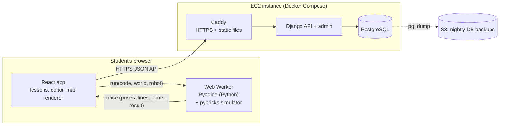
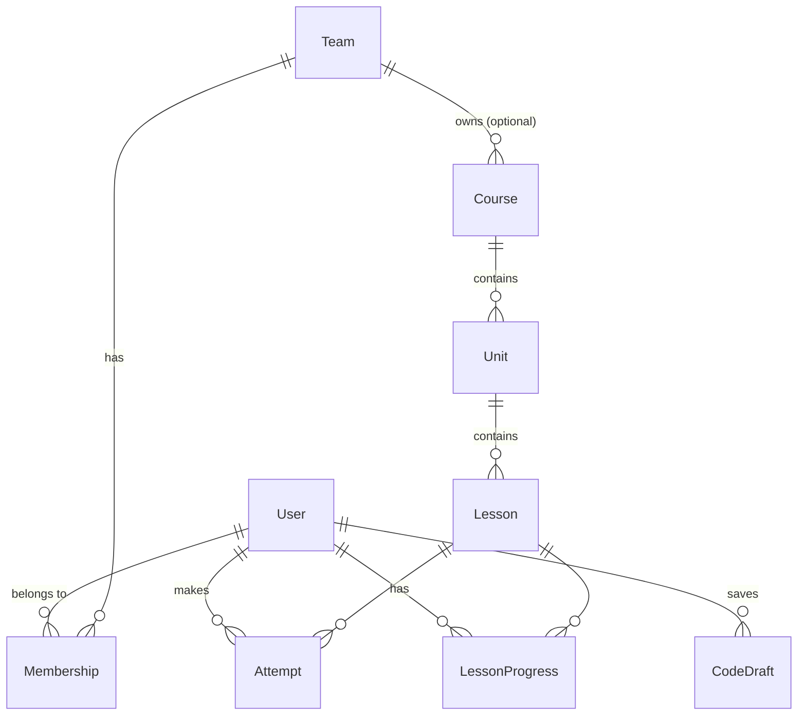

# Python Trainer: Architecture (v1.1)

A website that teaches FIRST LEGO League (FLL) Challenge students to program
their robot in Python with the [Pybricks](https://pybricks.com) API. The
centerpiece is a robot simulator in the browser: students write real Pybricks
code and watch a virtual robot drive on a virtual FLL table.

This document records the architecture decisions. The decision log at the
end lists what was settled and when.

---

## 1. Goals and constraints

| Topic | Decision |
|---|---|
| Audience | FLL Challenge students (about age 9 and up) with little text-coding experience, paired with older mentors |
| Robot API | Pybricks (`pybricks.hubs`, `pybricks.pupdevices`, `pybricks.robotics`, ...) |
| Core experience | Write Python, then watch a simulated robot run it. Moving the robot is the fun part. |
| Block coding | None. A read-only visualizer shows how loops and `if` statements run. |
| AI tutor | Not in v1. Leave room to add one later. |
| Users | Individual students in v1. The data model supports teams and coaches now; the coach UI comes later. |
| Lessons | Teachers can add their own lessons |
| Device | Laptop with a keyboard |
| Hosting | One AWS EC2 instance, reachable by students from other teams |

## 2. System overview



The server handles accounts, teams, lessons, saved code and progress.
**Student code never runs on the server.** It runs in the student's browser
inside a WebAssembly Python runtime (Pyodide).

## 3. Key decisions

| Decision | Choice | Why |
|---|---|---|
| Where student code runs | In the browser, using Pyodide inside a Web Worker | Running untrusted code from many kids on a public EC2 box would need a real sandbox, and that is a security project of its own. In the browser, each laptop does its own work, feedback is instant, and a classroom of 20 kids pressing Run doesn't overload a small server. |
| Language for the simulator | Pure Python, in the same Pyodide runtime as the student's code | Sensors must be read *while* the student's code runs (`color_sensor.reflection()` depends on where the robot is right now). Keeping the simulator in the same process avoids crossing between Python and JavaScript on every call. It can also be unit-tested with `pytest` and used in CI to check that lesson solutions still pass. |
| How the simulator runs | **Run first, then replay** (see §4.1) | Deterministic, fast, and no threading problems. Infinite loops are easy to cap. One trace drives both the robot animation and the code visualizer. |
| Backend | Django + Django Ninja (typed JSON API) + PostgreSQL | Built-in auth, database migrations and **Django admin, which gives teachers a lesson editor on day one**. It's Python end to end, which matches the subject. |
| Frontend | React + TypeScript + Vite; CodeMirror 6 editor; Canvas 2D renderer | Mainstream and well documented. CodeMirror is lighter than Monaco and makes Pybricks autocomplete easy to add. |
| Auth | Django session cookies (same domain) | Simpler and safer than JWTs for a single-domain app. |
| Deployment | Docker Compose on one EC2 instance: Caddy, Django (gunicorn), Postgres | Caddy provides automatic HTTPS. Because code runs in browsers, the server does very little and a small instance is enough. |

## 4. The simulator

### 4.1 Run first, then replay

1. The student clicks **Run**. The UI sends `{code, world, robot, options,
   goals}` to the Web Worker.
2. The worker starts a fresh simulation and turns on a line tracer
   (`sys.settrace`) for the student's file only. Then it runs the student's
   code.
3. Time is **virtual**:
   - Blocking Pybricks calls such as `drive_base.straight(300)` or
     `wait(500)` move the clock forward.
   - **Every line of student code costs 0.25 ms**, like a real hub running a
     loop, so `while sensor.reflection() > 50: pass` still lets the robot
     move.
   - The physics runs in fixed **5 ms ticks**, and sensors update once per
     tick.
   - Nothing waits in real time. A 34-second line-following run (136,000
     lines of Python) simulates in about 1.6 s in Chromium.
4. Sensor calls read the world at the robot's current pose.
5. The run ends in one of these ways:
   - The program finishes (or calls `raise SystemExit`).
   - It raises an error.
   - It reaches the time limit (default 150 s, the length of a match).
   - It reaches the line limit (a safety net).

   The limits raise a `BaseException`, so a student's `except Exception:`
   can't swallow them.
6. The worker returns a **trace**. The UI plays it back at real speed (or
   faster or slower) with a scrubber. It highlights the running line and
   shows the console, the variables and the sensor readings in sync with the
   robot.
7. Goals are checked by the simulator and returned in the trace. The UI
   reveals them when playback reaches the end. For signed-in students it also
   saves the attempt to the server.

If the worker doesn't respond within 20 s of wall-clock time, the UI stops it
and starts a new one.

### 4.2 Python package layout (`sim/src/`)

The simulator provides modules with the **same names as real Pybricks**, so
code copied from the site runs on a real hub:

```
sim/src/
  pybricks/            # simulated Pybricks API that students import
    hubs.py            # PrimeHub: imu, display, light, speaker, buttons
    pupdevices.py      # Motor, ColorSensor, UltrasonicSensor, ForceSensor
    robotics.py        # DriveBase
    parameters.py      # Port, Direction, Stop, Color, Button, Side, Axis, Icon
    tools.py           # wait, StopWatch
  umath.py, urandom.py, micropython.py   # MicroPython names
  trainer_sim/         # the engine (students never import this)
    sim.py             # virtual clock, physics tick, sensors, recorder
    motion.py          # motors, speed profiles, motor controllers
    drive.py           # DriveBase controller (encoders or gyro)
    world.py, shapes.py  # mat, painted shapes, zones, obstacles, walls
    robot.py           # robot file: wheels, body, ports
    runner.py          # runs student code with limits and the line tracer
    goals.py           # checks challenge goals
    errors.py          # kid-friendly explanations and pre-run warnings
    snapshot.py        # formats variables for the variables panel
sim/tests/             # pytest; also runs every challenge solution in content/
```

The same package runs in Pyodide (Python 3.14) in the browser and in regular
Python (3.11 or newer) for tests and CI. The frontend bundles the `.py`
files and writes them into Pyodide's file system when the worker starts.

**Imports are allowlisted**: `pybricks`, `math`/`umath`, `random`/`urandom`
and `micropython`. That matches what a real hub offers, and it keeps student
code away from browser APIs (see §12).

### 4.3 Pybricks API covered in v1

| Module | Supported |
|---|---|
| `robotics.DriveBase` | `straight`, `turn`, `curve`, `arc`, `drive`, `stop`, `brake`, `distance`, `angle`, `state`, `reset`, `settings`, `use_gyro`, `done`, `stalled`; `then=` and `wait=` on moves |
| `pupdevices.Motor` | `run`, `run_angle`, `run_target`, `run_time`, `run_until_stalled`, `dc`, `track_target`, `stop`, `brake`, `hold`, `angle`, `reset_angle`, `speed`, `done`, `stalled`, `control.limits`; `positive_direction`, `gears` |
| `pupdevices.ColorSensor` | `color`, `reflection`, `hsv`, `ambient`, `detectable_colors` |
| `pupdevices.UltrasonicSensor` | `distance`, `presence` |
| `hubs.PrimeHub` | `imu.heading/reset_heading/angular_velocity/tilt`, `display.text/number/char/icon/off`, `light.on/off`, `speaker.beep/play_notes`, `buttons.pressed` (scripted presses), `battery`, `system.set_stop_button` |
| `tools` | `wait`, `StopWatch` |

Calls that aren't supported yet, such as `multitask`, `run_task` and
`hub_menu`, raise a friendly "not in the simulator yet" message.

**Faithful mistakes.** The simulator only knows what a real drive base
knows, so common real-robot mistakes behave the same way:

- Forgetting `Direction.COUNTERCLOCKWISE` on the mirrored left motor makes the
  robot spin in place.
- A wrong `wheel_diameter` makes it drive the wrong distance.
- A `ColorSensor` on a motor's port raises the hub's "no device" error, with a
  friendly explanation.
- Pressing the center button stops the program, as it does on a real hub,
  unless the program picks another stop button with
  `hub.system.set_stop_button()`. The error explains how.

### 4.4 World model

- Units are millimeters and degrees, the same as Pybricks. The origin is the
  **bottom-left corner of the mat**, with x to the right and y up.
- Positive heading means **clockwise**, matching Pybricks, so
  `hub.imu.heading()` and `drive_base.turn(90)` agree with the drawing. A
  heading of 0 faces right.
- The default table is the FLL size, 2362 × 1143 mm, and the table's edges
  are walls.
- A world is a YAML file in `content/worlds/`:
  - **`shapes`**: painted shapes the color sensor can see, drawn in order
    (later shapes on top). There are four types:
    - `rect`, with an optional `angle`.
    - `circle`.
    - `line`: tape through points, with a `width`.
    - `arc`: part of a ring, sweeping clockwise from `start` to `end`.
  - **`zones`**: named, invisible areas used by goals. They're drawn as
    dashed outlines.
  - **`obstacles`**: rects and circles the robot bumps into. The robot stops
    and a `collision` event is recorded.
  - **`start`** pose, plus an optional `grid` spacing for the drawing. A
    challenge can override the start pose.
- **The color sensor sees a spot, not a point** (6 mm radius). Reflection
  blends smoothly across the edge of a line, which is what makes
  proportional line following work, just like on a real mat.
- Worlds are drawn from shapes instead of images. Color readings are exact,
  teachers can write worlds without an image editor, and we avoid
  copyrighted season-mat artwork.

### 4.5 Robot model

- **Standard robot**: "Trainer Bot" (`content/robots/trainer-bot.yaml`).

  | Part | Details |
  |---|---|
  | Wheels | 56 mm wheels, 112 mm axle track |
  | Port A | Left wheel (mounted mirror-image) |
  | Port B | Right wheel |
  | Port C | Color sensor, 75 mm ahead of the axle |
  | Port D | Ultrasonic sensor, at the front |
  | Ports E, F | Arm motors, with ±90° mechanical limits |

  Custom robots and robot mods come later.
- **Movement**: the robot steers by driving its two wheels at different
  speeds.
  - Motors are ideal position-controlled servos, limited by top speed
    (1000°/s), mechanical limits and collisions.
  - Moves follow trapezoid speed profiles (as set by
    `DriveBase.settings`).
  - With `use_gyro(True)`, the drive base corrects its heading using the
    gyro.
- **Realism** (`realism: on` in a challenge; fixed seed, so every run of the
  same code gives the same result):
  - The left wheel is 2.5% smaller than the right.
  - The wheels slip about 1%.
  - The gyro drifts 0.05°/s.
  - Sensor noise has a standard deviation of 1.5.

  Imperfections are added where wheel rotation becomes movement, so encoder
  readings stay perfect, like on a real robot. A challenge can also set its
  own amounts, e.g. `realism: {slip: 0.07}` for a slippery mat.
- **Stopping**: `stop()` lets the robot **coast** to a halt (about 45 mm from
  300 mm/s), and `brake()` stops it sooner (about 18 mm). When a program
  ends, the hub stops the motors and the robot rolls to a halt. This is what
  makes proportional speed control matter, as on a real robot.
- **Buttons**: a challenge can script hub button presses
  (`buttons: [{at: 1500, button: CENTER}]`), like a teammate starting each
  mission. Without the gyro, a 1.6 m
  straight drifts about 27 cm. With the gyro it stays on target. The
  "Straight as an Arrow" challenge teaches exactly this.

### 4.6 Trace format (worker → UI)

Frames are stored as columns to keep the trace small (about 50 frames per
second of robot time):

```jsonc
{
  "sim_version": "0.1.0",
  "frame_ms": 20,
  "start":   {"x": 200, "y": 200, "heading": 0},
  "frames":  {"t": [...], "x": [...], "y": [...], "heading": [...], "line": [...]},
  "sensors": {"gyro": [...], "C.reflection": [...], "C.color": [...], "D.distance": [...]},
  "motors":  {"E": [...], "F": [...]},             // arm angles
  "steps":   [[t, line], ...],                      // every line run (first 5000)
  "vars":    [{"t": 12.5, "vars": [["speed", "200", "global"], ...]}, ...],  // on change
  "prints":  [{"t": 1200, "line": 14, "text": "Found the line!"}],
  "events":  [{"t": 3400, "type": "collision", "what": "wall", "line": 9}],   // also beep, display, light, stalled
  "end":     {"reason": "finished" | "error" | "time_limit" | "step_limit", "t": 3600, "line": 9,
              "error": {"type": "NameError", "line": 5, "kid_message": "...", "python_message": "..."}},
  "warnings": [{"line": 7, "message": "`drive_base.stop` doesn't do anything by itself..."}],
  "goals":   [{"id": "no-errors", "label": "Program runs without errors", "passed": true, "detail": ""}, ...],
  "stats":   {"lines": 688, "sim_ms": 3600, "wall_ms": 40}
}
```

### 4.7 Challenge goals

Goals are declarative so teachers can write them without writing code.
Zone checks use the center of the robot. Any challenge with goals also gets
an automatic first goal: "Program runs without errors".

| Goal type | Example |
|---|---|
| `end_in_zone` | `{type: end_in_zone, zone: garage}` |
| `visit_zones` | `{type: visit_zones, zones: [a, b, c], in_order: true}` |
| `avoid_zones` | `{type: avoid_zones, zones: [pit]}` |
| `no_collisions` | Don't bump into walls or obstacles |
| `max_time` | `{type: max_time, seconds: 30}` |
| `must_use` | `{type: must_use, construct: for}`. Also `while`, `if`, `def`, `list`, `variable`, `fstring`, `floor_divide` (`//`) or `modulo` (`%`) (checked by parsing the code). |
| `max_calls` | `{type: max_calls, name: straight, value: 1}`. Encourages loops and functions. `value: 0` means "don't use it" (e.g. drive with motors instead). |
| `min_calls` | `{type: min_calls, name: pressed}`. The code must call it at least once (default 1). |
| `uses_variable_in` | `{type: uses_variable_in, name: straight}`. Every call gets a variable, not a plain number. |
| `printed` | `{type: printed, text: "Found it"}` |

## 5. Code visualizer

The visualizer is read-only. Students watch it; they don't build anything
with it. It uses the same recording as the robot playback, in two modes.

**Robot time (challenges)**: the trace plays at real speed (0.5× to 4×) with a
scrubber. The running line is highlighted in the editor. The console,
variables (changed values flash) and sensor readings follow the robot.

**Step mode** (`visualize` blocks, and "👣 Step through" on any example) shows
one line at a time. The controls are start, back, play/pause, forward and a
speed setting. For each step it shows:

- **The line about to run**, highlighted.
- **How many times each line has run**, in a gutter (`×3`). This makes loops
  and skipped branches visible at a glance.
- **A note on the current line**, computed from the program's structure
  (`trace.structure`: every `for`, `while`, `if` and `elif`, with the lines of
  its body) and from the next step:
  - `if`/`elif`: "✔ True: runs the indented lines" or "✖ False: skips them".
  - `for`: "🔁 round 2: side = 1", with the loop variable's next value.
  - `while`: "🔁 round 2: condition is True", then "✅ loop done after 3 rounds".
  - While inside a loop, the loop's first line keeps a "🔁 round k" badge.
- **Variables and output so far**, next to the code.

Timing: every recorded print and step is stamped to 0.01 ms, and a print
made by line *k* has the same time as step *k + 1*. So output appears exactly
when the student steps past the line that printed it. Step mode shows up to
5000 steps; content checks reject `visualize` blocks that need more.

## 6. Kid-friendly errors

Every error shows two messages: the real Python message (so students learn to
read it) and a plain-English explanation that points to the line. The
explanations come from a curated list, with no AI involved. Examples:

- `IndentationError` → "Python uses spaces at the start of a line to know
  what's inside a loop. Line 6 needs to line up with line 5."
- `NameError: 'drivebase'` → "Python doesn't know `drivebase`. Did you mean
  `drive_base` from line 3?"
- A missing `:` → "Lines that start with `for`, `if`, `while` or `def` need a
  `:` at the end."
- A warning before running: `drive_base.straight` without `(...)` does
  nothing.

## 7. Lessons and authoring

### 7.1 Content structure

**Course → Unit → Lesson → Blocks**. There are five block types:

| Block | Purpose | Fields |
|---|---|---|
| `text` | Markdown explanation (Python code fences are highlighted) | `markdown` |
| `example` | Code the student can run, edit and step through; shows output and errors | `code`, `expect_error` |
| `visualize` | Opens in step mode (§5); students can still edit and re-run | `code`, `expect_error` |
| `quiz` | Multiple choice. `check: output` is "what does this print?": the checker runs `code` and makes sure the answer matches the real output. | `question`, `code`, `choices` (text, or `{text, why}`), `answer` (index from 0), `explain`, `check` |
| `challenge` | Editor + simulator + goals + hints. Without `world` it's a console-only challenge. `ref:` reuses a playground challenge. | same as a playground challenge file |

Every block gets an `id` (given, or `block-N` from its position), which
progress and saved code are keyed on.

### 7.2 Lesson files

```
content/courses/fll-python/course.yaml            # id, title, summary
content/courses/fll-python/01-meet-the-robot/unit.yaml     # id, title, icon, summary
content/courses/fll-python/01-meet-the-robot/01-hello-python.yaml
content/courses/fll-python/01-meet-the-robot/02-first-moves.yaml
content/challenges/*.yaml                          # playground challenges
```

Units and lessons are ordered by their file names. Code is written inline in
the YAML, which keeps each lesson a single JSON document for the database
(§8). A short example:

```yaml
id: for-loops
title: Repeat with for
summary: Use a for loop to repeat code a set number of times.
blocks:
  - type: text
    markdown: |
      Robots do the same thing again and again...
  - type: visualize
    code: |
      for side in range(4):
          print("Round", side)
  - type: quiz
    check: output
    question: What does this program print?
    code: |
      for i in range(3):
          print("beep")
    choices: ["beep", "beep\nbeep\nbeep"]
    answer: 1
  - type: challenge
    ref: square-dance          # reuse a playground challenge
```

**Pages.** The lesson player splits a lesson into pages. A page ends after
each interactive block (example, visualize, quiz, challenge), so text always
introduces the thing that follows it. On a challenge page, the page's text is
shown in the challenge card, above the challenge's own instructions.

**Progress.**
- A quiz must be answered correctly before the student can continue. Wrong
  answers show the choice's `why`.
- A challenge with goals can be skipped, but the lesson only counts as
  complete once it's solved.
- A lesson is complete when the student reaches the end with every quiz and
  goal challenge done.
- Progress and edited code are saved on the server for signed-in students
  (`LessonProgress`, `CodeDraft`, `Attempt`), and in the browser for guests
  (§10).

**Validation** (`sim/src/trainer_content`, run by `pytest`, `import_content` and the
backend):
- Structure, ids and quiz answers.
- Examples and visualize blocks must run (or fail, when `expect_error` is
  set).
- Output quizzes are checked against the real output.
- Goal zones must exist in the world.
- Challenge solutions must pass their goals, and starters must run without
  already passing.

### 7.3 How teachers add lessons

- **Database is the source of truth at runtime.** A lesson's content is stored
  as JSON (the blocks as written, with `ref:` left unexpanded), and expanded
  when it's served.
- **File import**: `manage.py import_content` checks every lesson, then loads
  or updates the lessons in `content/`. It runs on every deploy. If any
  lesson has a problem, nothing is imported.
- **Web editing**: in the Django admin (Curriculum → Lessons), a lesson's
  blocks are edited as YAML in a large text box. Multi-line text is shown as
  readable `|` blocks.
  - **Saving runs the full checker**, and a lesson with problems isn't
    saved (the problems are listed). Lesson code is real Python, and the
    simulator's import rules don't stop a determined author, so it never
    runs inside the web server. In production it runs in the `checker`
    container (`trainer_content.server`): no network, no secrets, a
    read-only disk, and limits on memory and processes. Django reaches it
    through a Unix socket in a shared volume. Each check is a process of its
    own with a time limit, a memory limit, no new processes and no file
    writes (`trainer_content.sandbox`). If the checker isn't running,
    lessons can't be saved. In development the check runs in that limited
    process on your computer.
  - Worlds, the robot and playground challenges have YAML editors too.
  - "Open ↗" previews the lesson on the site. Staff can see unpublished
    lessons.
- **Lessons from files** show a warning in the admin: edits are replaced at
  the next import. Changing the slug turns it into an admin-owned copy.
- **Team-specific lessons**: a course has an optional owner team. Blank means
  everyone can see it; otherwise only that team can. This lets a coach write
  lessons just for their team.
- **Versioning**: a lesson's `version` goes up whenever its content changes.
  Attempts record the version they were made against.
- **Later**: a friendlier authoring UI with a visual world editor.

### 7.4 Curriculum

All 12 units are written: 28 lessons, each ending in a challenge. Every
solution is checked in CI.

| Unit | Lessons (challenges) |
|---|---|
| 1. 🤖 Meet the Robot | Hello, Python! (Robot Greeting) · First Moves (First Drive) · Turning (Around the Crate) |
| 2. 📦 Variables | Variables Are Boxes (Score Keeper) · Variables Drive the Robot (There and Back Again) · Text and Numbers (Mission Report) |
| 3. 🧮 Math for Robots | Python Is a Calculator (Match Timer) · Wheels and Circles (Motor Math) · Speed × Time (Timed Parking) |
| 4. 🔁 Loops | Repeat with for (Square Dance) · Repeat with while (Stop at the Line) · Lists and Loops (Spiral) |
| 5. 🔀 Decisions | If This, Then That (Traffic Light) · Many Choices: elif, and/or/not, break (Color Commands) |
| 6. 🧩 Functions | Your Own Commands (Staircase) · Inputs and Outputs: parameters, return (Two Squares, Unit Converter) |
| 7. 📋 Lists and Dictionaries | Working with Lists: sum/max, lists of pairs (Delivery Route) · Dictionaries (Score Sheet) |
| 8. 📡 Sensors | The Color Sensor: counting with a state variable (Count the Lines) · The Gyro: gyro turns (Slippery Square) |
| 9. 〰️ Line Following | Wiggle Along the Line: bang-bang (Wiggle Follower) · Smooth Following: proportional (Line Follower) |
| 10. 🎯 Proportional Control | Straight with the Gyro (Your Own Gyro Controller) · Smooth Parking (Smooth Parking) |
| 11. 🏁 Mission Runner | Missions as Functions (Two Missions) · Press to Start: hub buttons (Press to Start) |
| 12. 🐞 Debugging | Reading Error Messages (Bug Hunt) · Detective Work: logic bugs (Fix the Line Stopper) |

## 8. Accounts, teams and data model



| App | Model | Key fields |
|---|---|---|
| `accounts` | `User` (custom) | username (unique, ignoring case), password hash (the PIN for students), `kind` (student/adult), `display_name`, `avatar` (a preset emoji), `failed_logins`, `locked_until`. **Students have no email.** |
| | `LoginFailure` | ip, created_at (IP throttling; cleaned up after a day) |
| `teams` | `Team` | name, season, `join_code` (6 characters, with no 0/O/1/I), `robot` (the team's real robot: a port for each part, wheel directions and sizes; empty means "built like the Trainer Bot") |
| | `Membership` | user, team, role: `student` / `mentor` / `coach` |
| `curriculum` | `World`, `Robot`, `PlaygroundChallenge` | slug, spec (JSON, as in the YAML files) |
| | `Course` → `Unit` → `Lesson` | slug, title, order, published; `Course.owner_team` (optional); `Lesson.content` (JSON blocks as written), `Lesson.version`, `Lesson.source` (the file it came from) |
| `progress` | `LessonProgress` | user, lesson, page, done (block ids), finished. Merges only move forward. |
| | `CodeDraft` | user, key (`lesson/<lesson>/<block>` or `playground/<id>`), code |
| | `Attempt` | user, key, lesson, block_id, lesson_version, code, passed, goals, sim_version |

**Who can do what** lives in one place, `teams/permissions.py`:

- Everyone sees their own work.
- A team's **coaches and mentors** see its students' progress and code, and
  the challenge solutions.
- Only **coaches** change things: make student accounts, give new PINs,
  unlock accounts, make a student a mentor, take someone off the team, change
  the join code, and describe the team's robot. They can only change kids'
  accounts, never an adult's or an admin's.
- **Staff** (site admins) can see and change every team.

Any adult account can make a team and becomes its coach. Admins make coach
accounts in the admin or with `manage.py create_coach`.

Pass/fail is computed in the browser and reported to the server. A student
could fake a pass. That's fine for a learning tool, and it's the trade-off
for never running student code on the server.

## 9. API

Django Ninja (JSON, session cookies, CSRF). The OpenAPI docs are at
`/api/docs`.

```
GET  /api/csrf                       sets the CSRF cookie
GET  /api/health                     uptime check (checks the database too)
POST /api/auth/signup                {username, pin, display_name, avatar, join_code}
POST /api/auth/login                 {username, secret}   (a PIN, or a password for adults)
POST /api/auth/logout
GET  /api/auth/me                    {user: ... | null}
GET  /api/auth/suggest-username
POST /api/teams/join                 {code}
GET  /api/teams                      the teams you coach or mentor (staff: all)
POST /api/teams                      {name, season}   adults only; you become the coach
GET  /api/teams/{id}                 team page: join code, robot, students with progress, leaders
PATCH /api/teams/{id}                {name?, season?, robot?}             coaches
POST /api/teams/{id}/join-code       a new join code                      coaches
POST /api/teams/{id}/members         {students: [{display_name, username?}]}  up to 10 per call;
                                     returns each username and PIN (shown only this once)  coaches
GET  /api/teams/{id}/members/{user}  one student's lessons, and each challenge's runs and code
POST /api/teams/{id}/members/{user}/pin     a new PIN (also unlocks)      coaches
POST /api/teams/{id}/members/{user}/unlock                                coaches
PATCH /api/teams/{id}/members/{user} {role: student | mentor}             coaches
DELETE /api/teams/{id}/members/{user}  off the team (the account stays)   coaches
GET  /api/catalog                    courses (lesson titles), playground, worlds, robot
GET  /api/lessons/{slug}             blocks with playground refs expanded
GET  /api/me/state                   progress, solved playground challenges, drafts
POST /api/me/import                  merge a guest's browser progress into the account
PUT  /api/progress/{slug}            {page, done, finished}  (merged, never goes backwards)
PUT  /api/drafts                     {key, code}
POST /api/attempts                   {key, code, passed, goals, sim_version, lesson_id, block_id}
```

**Challenge solutions are only sent to coaches, mentors and staff.** Quiz
answers are sent to everyone (the browser checks them), which is fine for
practice quizzes.

## 10. Frontend

- **Routes** (hash-based, so the server needs no rewrite rules):
  - `#/`: the course map.
  - `#/lesson/<slug>/<page>`.
  - `#/playground/<id>`.
  - `#/signup`, `#/signin` and `#/account`.
  - `#/teams`, `#/teams/<id>` and `#/teams/<id>/<username>`: the coach
    tools. The **👥 Teams** link shows for adults, mentors and staff.
- **Team pages** (`pages/TeamPages.tsx`):
  - A progress grid: one row per student, one column per unit, with last
    activity and playground challenges solved.
  - **Add students**: one nickname per line (optionally `nickname,
    username`). Accounts are made 10 at a time, because each PIN takes a
    moment to hash, and come back as **printable sign-in cards**.
  - The join code, the team's robot, team details, coaches and mentors.
  - A student's page: every lesson's status, and every challenge with its
    runs, its latest code, the code that passed, and what's in the editor
    now. Coaches also get new PIN, unlock, mentor and remove buttons.
- **Run on your robot** (`pybricks.ts`, `components/RunOnRobot.tsx`): a
  dialog that gets a challenge's code ready for
  [Pybricks](https://code.pybricks.com), with the steps to run it on a real
  hub.
  - Lesson code is written for the Trainer Bot. If the student's team has
    described its robot, the setup is rewritten to match: every `Port.X` moves
    to the team's port for that part, a wheel motor mounted the other way gets
    the other `Direction`, and the Trainer Bot's `wheel_diameter` and
    `axle_track` become the team's. Comments and strings are left alone (the
    code is parsed with @lezer/python first), and every change is listed.
  - It warns about things that will fail on the robot: a part the team's robot
    doesn't have, wheel sizes it couldn't find, and reading the buttons without
    changing the stop button. It also gives a few real-robot tips.
  - Copying uses the clipboard. There's no direct Bluetooth download yet.
- **Start-up**: the app loads the catalog and the session, and shows the app
  once both have arrived. Lessons are loaded when opened, and cached.
- **Session store** (`session.ts`):
  - **Guests** keep progress, drafts and solved challenges in
    `localStorage`.
  - **Signed-in students** get them from `/api/me/state`. Changes show
    instantly and are sent to the server in the background (drafts after an
    800 ms pause). A "⚠ Not saved yet" pill appears if saving fails.
    Signing out first sends anything still waiting to be saved.
  - **Signing up or in as a guest** merges the guest's progress into the
    account, then clears it from the browser.
- **Libraries**: React, CodeMirror 6 (Python mode, Pybricks autocomplete,
  line decorations), Canvas 2D, marked + DOMPurify (lesson Markdown),
  and @lezer/python (code highlighting in lesson text). No router or data
  library is needed at this size.
- **Pyodide** is served from our own domain rather than a CDN, because some
  school networks block CDNs.

## 11. Deployment

See **[DEPLOY.md](DEPLOY.md)** for the step-by-step guide. In short:

- **AWS, from one CloudFormation template** (`deploy/aws/python-trainer.yml`):
  - An EC2 server (Ubuntu 24.04, t3.small by default) with an Elastic IP,
    termination protection, an encrypted disk, IMDSv2 with a hop limit of 1,
    and no SSH port (shell access is through Session Manager).
  - Two ECR repositories (`web`, `caddy`): immutable tags, scanned on push,
    keeping the last 30 versions.
  - A private, encrypted S3 bucket for backups (90 days, kept if the stack
    is deleted).
  - GitHub's OIDC provider and a deploy role that only `main` and the
    `production` environment can assume. It can only push to those two
    repositories and run commands on that one server.
  - Optionally, the Route 53 record.
- **First boot** (`deploy/aws/bootstrap.sh`): Ubuntu's Docker packages, the
  AWS CLI, a swap file, `deploy/.env` with secrets generated on the server,
  and a nightly backup job.
- **Docker Compose** (`deploy/docker-compose.yml`) runs four containers:
  - `caddy`: automatic HTTPS; serves the built app and Pyodide; proxies
    `/api`, `/admin` and `/static`.
  - `web`: Django on gunicorn. On start it migrates the database and
    re-imports `content/`, but only if every lesson passes its checks.
  - `checker`: runs the code in lessons saved in the admin (§7.3), walled
    off from everything else. It uses the `web` image.
  - `db`: PostgreSQL 17 on a persistent volume.
  The images are `$IMAGE_REPO/web:<commit>` and `$IMAGE_REPO/caddy:<commit>`.
- **Continuous deployment** (GitHub Actions):
  1. `ci.yml` runs every test.
  2. On `main`, once everything passes, it builds the images and pushes them
     to ECR, tagged with the commit (`APP_VERSION` is baked in).
  3. `deploy.yml` sends `deploy/deploy.sh <commit>` to the server through
     Systems Manager (`deploy/aws/ssm-deploy.sh`).
  4. `deploy.sh` backs up the database, pulls the images, restarts `web` and
     `caddy`, and waits for `/api/health` to report the new commit. If it
     doesn't, it rolls back to the previous version and fails.
  5. The workflow checks that the public site reports the new commit.
  - Deploys run one at a time. `deploy.yml` can also be run by hand to
    deploy (or go back to) any earlier commit.
  - It's off until the repository variable `DEPLOY_TO_AWS` is `true`.
- **Security headers** (Caddyfile):
  - HSTS, `nosniff`, a referrer policy and a permissions policy.
  - A **Content-Security-Policy** that allows only this origin, plus
    `'wasm-unsafe-eval'` so Pyodide can run WebAssembly.
  - Hashed assets are cached for a year; the page itself is `no-cache`.
- **Backups**: `deploy/backup.sh` runs `pg_dump` nightly and before every
  deploy, keeps 14 days on the server, and uploads to S3.
- **CI checks**: simulator and lesson checks (Python 3.11 and 3.14), backend
  tests on PostgreSQL plus a missing-migrations check, typecheck, unit tests,
  build, browser tests against the real backend, and Docker image builds.

## 12. Sign-in and privacy (children under 13)

- **Sign-up**: students choose a **username and a 6-digit PIN**, with an
  optional nickname, a preset avatar and a team code. There's no email,
  real name or birth date. A 🎲 button suggests a made-up username (like
  "BraveOtter42"), and the form warns not to use a real name.
- **Coach-made accounts**: a coach can make the accounts instead. They type
  nicknames (first names or initials; the page asks for no last names), and
  get a made-up username and PIN for each, on printable cards. PINs come
  from the system's secure random numbers, are shown only once, and are
  stored only as hashes. A coach can give a student a new PIN at any time,
  which also unlocks the account.
- **PIN security**: a PIN is short, so it gets extra protection:
  - Hashed the same way Django hashes passwords.
  - After 5 wrong PINs, the account locks for 5 minutes. Sign-ins to one
    account take turns (the account's row is locked while it's checked),
    so a burst of guesses can't slip past the lock.
  - After 30 failures from one IP address, that address is blocked for 15
    minutes. A school shares one address, so misses followed by the right
    PIN for the same username are forgiven: those were typos, not guesses.
    IPv6 addresses count per /64 network.
  - Usernames that don't exist take as long to check as real ones.
  - The admin's sign-in has the same rules.
  - Per computer: at most 50 new accounts an hour and 40 wrong team codes
    every 15 minutes. Per student: at most 600 saved challenge runs an hour.
    Staff can lift a block early by deleting its rows in the admin
    (Accounts → Login failures / Rate limit hits).
  - Obvious PINs are refused: repeats (`111111`, `121212`, `408408`) and
    counting (`123456`, `987654`).
  - Adults use full passwords (at least 10 characters, checked by Django's
    validators).
  - A coach (on the team page) or an admin can give a student a new PIN, or
    unlock the account. A new PIN lets whoever has it sign in as the
    student, so the coach types their password again first (it's good for
    15 minutes).
- **Staying signed in**: students stay signed in for a month on their own
  laptop. Coaches and admins can do much more, and school computers are
  shared, so their sessions end after 2 hours without use and 12 hours
  after signing in (`accounts.sessions`). When someone opens the app still
  signed in from an earlier visit, a note asks "Not you? Switch account".
- Collect as little as possible. Students get a username, a display name and
  a preset avatar, with no free-text profile.
- Student code and attempts are visible only to the student and to their
  team's coaches and mentors. Coaches read the code; they don't run it.
- Nothing is sent to third parties. No analytics SDKs in v1.
- **When coaches can run a student's code** (a later feature), the simulator
  worker must have no access to the coach's logged-in session. For example,
  it can be served from a separate origin, so student code can't make API
  calls as the coach. v1 already blocks imports that aren't on an allowlist
  (§4.2). Real hubs don't have most Python modules, so this also teaches the
  real limits.

## 13. Repository layout

```
python-trainer/
  sim/          Python simulator + simulated pybricks package (pytest, uv);
                trainer_content: lesson loader and checker (reused by the backend)
  backend/      Django project: accounts, teams, curriculum, progress (pytest)
  frontend/     React + TS app: course map, lesson player, visualizer,
                editor, renderer, worker (vitest, Playwright)
  content/      Courses, playground challenges, worlds and the robot (YAML)
  deploy/       Dockerfile, docker-compose.yml, Caddyfile, deploy and backup scripts;
                aws/: the CloudFormation stack, first-boot and Systems Manager scripts
  docs/         This document and DEPLOY.md
```

## 14. Roadmap

| Milestone | Scope |
|---|---|
| **M1: Simulator playground** ✅ | `sim/` package + tests; Web Worker with Pyodide; mat renderer; editor; trace playback; friendly errors. No accounts. This is the riskiest and most fun part, so it gets built and tested with a real kid first. |
| **M2: Lessons** ✅ | Lesson schema, lesson player, visualizer, quizzes, goals, hints; first 4 units of the curriculum |
| **M3: Accounts & progress** ✅ | Django backend, teams and join codes, drafts, attempts, progress, admin lesson editing, content import and validation |
| **M4: Deploy** ✅ | EC2 + Compose + Caddy + backups + CI |
| **M5: Rest of the curriculum** ✅ | Units 5–12: decisions, functions, lists and dictionaries, sensors, line following, proportional control, mission runner, debugging |
| **M6: Coach tools and real robots** ✅ | Team pages: progress grid, coach-made accounts with printable cards, PIN resets, mentors, a student's code. "Run on your robot": code rewritten for the team's robot, ready for Pybricks. The hub's stop button in the simulator. |
| **M7: Continuous deployment** ✅ | One CloudFormation stack (server, ECR, backups, GitHub OIDC role); every merge to main is tested, built, deployed through Systems Manager, health-checked, and rolled back if it doesn't start |
| **Later** | Coaches running a student's code in the simulator (needs the separate origin in §12), a friendlier lesson authoring UI with a world editor, an AI tutor (a proxy endpoint on the server), pushable mission models, simulating a team's own robot, season-specific mats, sending code straight to the hub over Bluetooth, `hub_menu` and `multitask` in the simulator |

## 15. Decision log

| Date | Decision |
|---|---|
| 2026-09-26 | Pybricks API, browser simulator, no block coding, AI tutor later, coach app later but data model ready |
| 2026-09-26 | Student code runs in the browser (Pyodide). The EC2 server stores accounts, lessons and progress. |
| 2026-09-26 | Early sign-up with username + PIN. Later, coaches manage accounts and hand out usernames and PINs. |
| 2026-09-26 | One standard training robot ("Trainer Bot"). Custom robots and robot mods come later. The app is mainly about Python. |
| 2026-09-26 | Original practice mats built from shapes. No copyrighted season artwork. |
| 2026-09-26 | Pushing or collecting mission models comes after v1 |
| 2026-09-27 | Lessons are YAML files with code inline, paged after each interactive block. Quizzes gate progress; challenges can be skipped. |
| 2026-09-27 | Content is served from the database, with solutions only for coaches, mentors and staff. Guests keep progress in the browser, and it's imported when they sign up. |
| 2026-09-27 | Admin lesson saves run the checker in a separate process with time and memory limits. Lessons from files are re-imported on each deploy, and the admin warns about this. |
| 2026-09-27 | Lesson code from the admin runs in its own `checker` container (no network, no secrets, read-only disk), not next to the web server, so a staff account that can edit lessons can't reach the database or the secret key. The admin's sign-in has the same lockouts as the app's. |
| 2026-09-27 | `stop()` coasts and `brake()` stops sooner, like a real robot, so proportional control is worth learning. |
| 2026-09-27 | Coach tools: coaches and mentors see their team's work; only coaches change accounts, and only kids' accounts. PINs are shown once, on printable cards. |
| 2026-09-27 | Running on a real robot: lessons keep using the Trainer Bot, and code is rewritten for the team's robot (ports, directions, wheel sizes) when it's copied to Pybricks. Simulating each team's own robot comes later. |
| 2026-09-27 | The center button stops programs in the simulator, like on a real hub. The Press to Start lesson teaches `set_stop_button()`. |
| 2026-09-27 | Continuous deployment: CI builds images and pushes them to ECR, and deploys over AWS Systems Manager with GitHub OIDC. No SSH and no stored keys. Automatic rollback when the health check doesn't report the new version. Infrastructure is one CloudFormation stack. |
